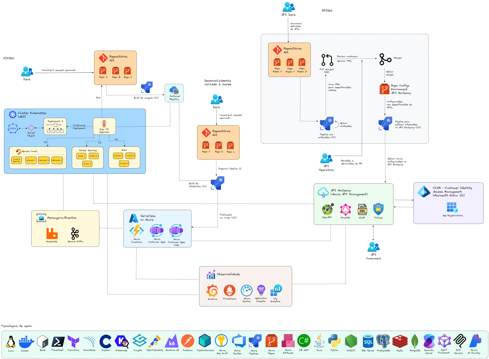

# arquitetura-integracoes-2025-11

Apresentação sobre Arquitetura de Integrações realizada no dia 04/11/2025. Tecnologias e tópicos abordados: Kubernetes, Docker, Azure DevOps, APIOps, GitOps, Linux, Azure, Apache Camel, Inteligência Artificial...

---

## Arquitetura de referência

## Tecnologias e práticas empregadas

### APIs
- Azure API Management: https://learn.microsoft.com/en-us/azure/api-management/
- APIOps: https://learn.microsoft.com/en-us/azure/architecture/example-scenario/devops/automated-api-deployments-apiops
- Microsoft Entra ID: https://learn.microsoft.com/en-us/entra/identity/

### Containers
- Cloud Native Computing Foundation (CNCF): https://www.cncf.io/projects/
- CNCF Landscape: https://landscape.cncf.io/
- Kubernetes: https://kubernetes.io/docs/home/
- Azure Kubernetes Service (AKS)
- GitOps: https://learn.microsoft.com/en-us/azure/architecture/example-scenario/gitops-aks/gitops-blueprint-aks
- Git: https://git-scm.com/doc
- Argo CD: https://argoproj.github.io/cd/
- Apache Camel: https://camel.apache.org/docs/
- KEDA (Kubernetes Event-driven Autoscaling): https://keda.sh/
- Azure Container Registry: https://learn.microsoft.com/en-us/azure/container-registry/
- Docker Scout (scanning de vulnerabilidades em imagens): https://docs.docker.com/scout/

### Desenvolvimento voltado à nuvem
- Azure Container Apps: https://learn.microsoft.com/en-us/azure/container-apps/
- Azure Functions: https://learn.microsoft.com/en-us/azure/azure-functions/

### Observabilidade

- Grafana: https://grafana.com/docs/
- Prometheus: https://prometheus.io/docs/introduction/overview/
- Azure Monitor: https://learn.microsoft.com/en-us/azure/azure-monitor/
- Application Insights: https://learn.microsoft.com/en-us/azure/azure-monitor/app/app-insights-overview
- Log Analytics: https://learn.microsoft.com/en-us/azure/azure-monitor/logs/log-analytics-tutorial

### Mensageria/Eventos

- RabbitMQ: https://www.rabbitmq.com/docs
- Apache Kafka: https://kafka.apache.org/documentation/

### Tecnologias e metodologias de apoio
- OWASP Top 10 API Security Risks: https://owasp.org/API-Security/editions/2023/en/0x11-t10/
- Linux: https://docs.kernel.org/
- Docker: https://docs.docker.com/ 
- Azure DevOps: https://learn.microsoft.com/en-us/azure/devops/?view=azure-devops
- Azure Pipelines: https://learn.microsoft.com/en-us/azure/devops/pipelines/?view=azure-devops
- Azure Repos: https://learn.microsoft.com/en-us/azure/devops/repos/?view=azure-devops
- Azure Artifacts: https://learn.microsoft.com/en-us/azure/devops/artifacts/?view=azure-devops
- Azure Key Vault: https://learn.microsoft.com/en-us/azure/key-vault/general/basic-concepts
- Terraform: https://developer.hashicorp.com/terraform/docs
- SonarQube: https://docs.sonarsource.com/
- Checkov: https://www.checkov.io/
- Kubescape: https://kubescape.io/
- Traefik Proxy: https://traefik.io/traefik
- OpenTelemetry: https://opentelemetry.io/
- Grafana k6: https://k6.io/
- Postman: https://learning.postman.com/docs/introduction/overview/
- Testcontainers: https://testcontainers.com/
- Bash: https://www.gnu.org/software/bash/manual/bash.html
- PowerShell: https://learn.microsoft.com/en-us/powershell/
- .NET: https://learn.microsoft.com/en-us/dotnet/
- Java: https://docs.oracle.com/en/java/
- Python: https://docs.python.org/3/
- Node.js: https://nodejs.org/en
- SQL Server: https://www.microsoft.com/en-us/sql-server
- PostgreSQL: https://www.postgresql.org/
- Redis: https://redis.io/
- MongoDB: https://www.mongodb.com/
- Semantic Kernel: https://github.com/microsoft/semantic-kernel
- Microsoft Agent Framework: https://github.com/microsoft/agent-framework
- MCP (Model Context Protocol): https://modelcontextprotocol.io/docs/getting-started/intro
- Azure AI Foundry: https://learn.microsoft.com/en-us/azure/ai-foundry/what-is-azure-ai-foundry